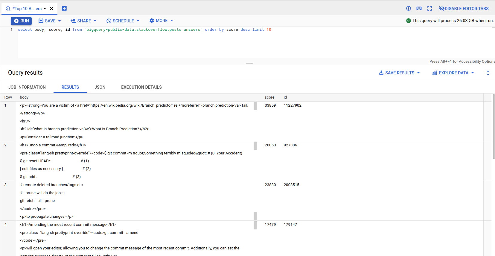
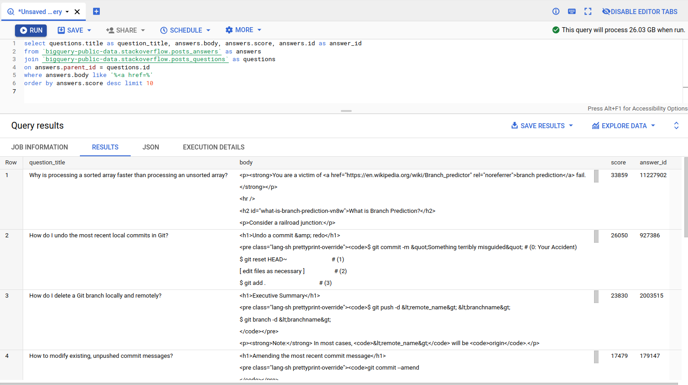
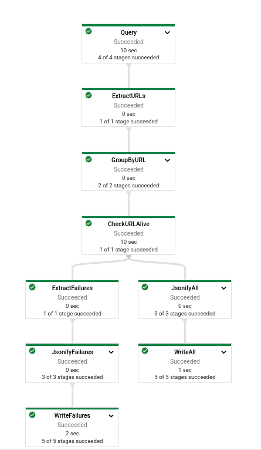
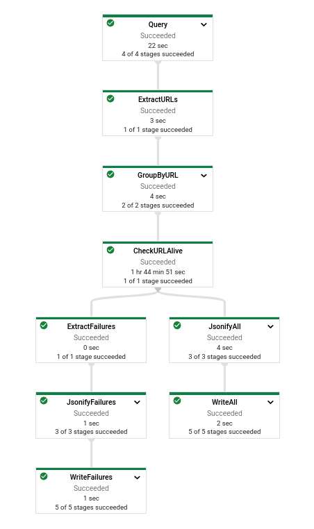
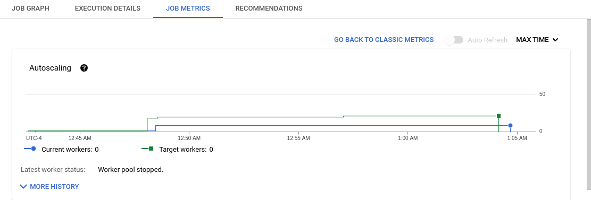
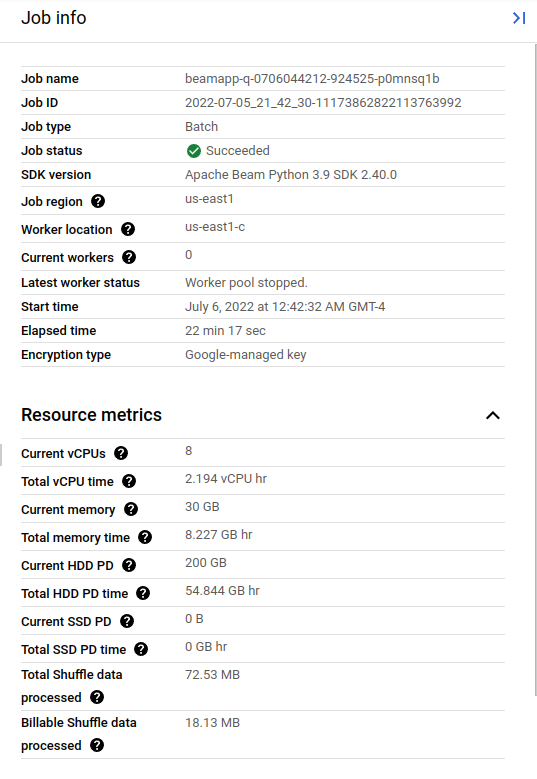
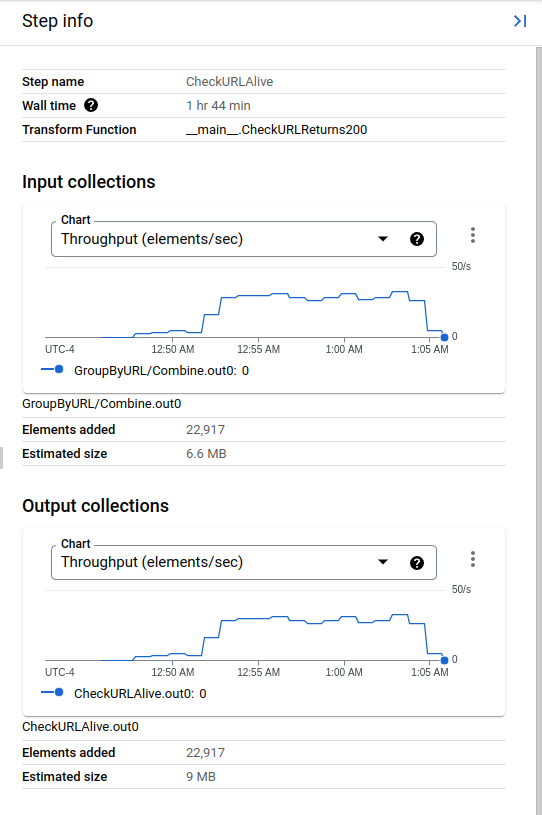
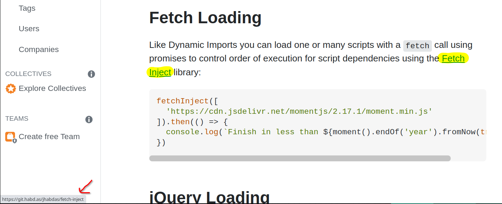
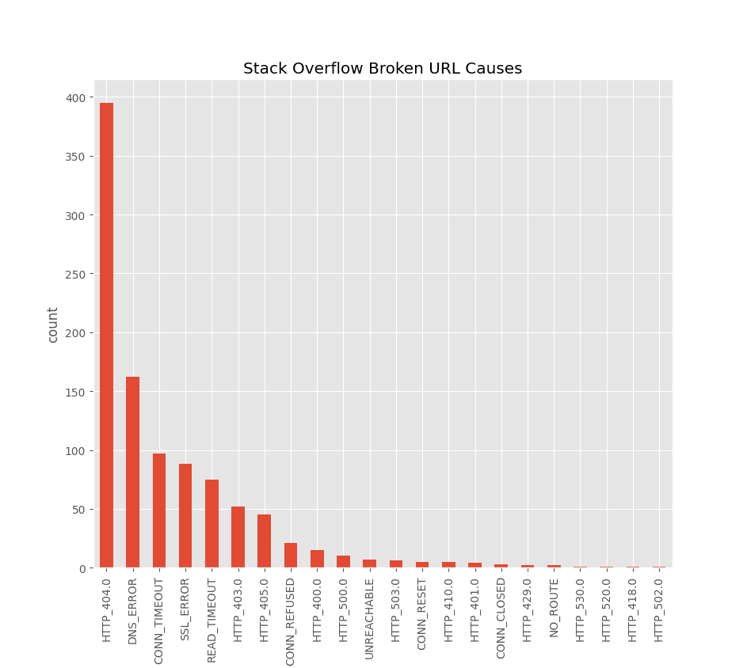

# Finding Broken Links on Stack Overflow with BigQuery and Dataflow

StackOverflow is a Q&A website for programming questions. Excellent answers will often link to
external resources elsewhere on the web. Unfortunately, not all of these links stay up forever.
Broken links on StackOverflow can frustrate developers and waste time. I wanted to build an
automated solution to detect these broken links so that I could fix them!

This is a writeup about a project where I used BigQuery and Google Cloud Dataflow to build
a batch pipeline that checks the top 10,000 StackOverflow answers for broken links, exporting
the results to Google Cloud Storage. 

In the end I discovered that around 4% of all links in the top 10,000 StackOverflow answers
were broken! Many of these broken links were present on questions with millions of views!
I also learned that the primary cause of broken links was HTTP 404s. Around 40% of the
broken links were caused by 404s, with the next largest contributor being DNS issues,
accounting for 15% of broken links.

## Finding StackOverflow Answers Using BigQuery
BigQuery generously provides a public dataset of StackOverflow questions and answers. Using
this, one can directly query for Stack Overflow questions and answers.

Here's an example query that returns the top 10 highest-voted answers on Stack Overflow.
```sql
select body, score, id from `bigquery-public-data.stackoverflow.posts_answers`
order by score desc limit 10
```



From that query, one can see the most upvoted StackOverflow answer of all time is
[https://stackoverflow.com/a/11227902](https://stackoverflow.com/a/11227902), which
contains a wonderful write-up about modern CPUs and branch prediction. It's well worth
a read if you haven't seen it already!

But I'm not interested in _all_ StackOverflow answers, just the ones with broken links.
Of-course there's no way I can write a query to select only the answers with broken links, so
for now the best I can do is to write a query to select only the answers that
contain at-least one link. With that in mind, I ended up with this query:

```sql
select questions.title as question_title, answers.body, answers.score, answers.id as answer_id
from `bigquery-public-data.stackoverflow.posts_answers` as answers
join `bigquery-public-data.stackoverflow.posts_questions` as questions
on answers.parent_id = questions.id
where answers.body like '%<a href=%'
order by answers.score desc limit 10
```

This query gets the top 10 highest-voted answers on Stack Overflow with at-least one link.
Those top answers are then joined with the questions table to get the question title.



## Detecting Broken Links With an Apache Beam Pipeline

Now that I had a way to extract the top N most-upvoted answers across StackOverflow,
I needed to build a pipeline to do the following:

1. Get the top answers from BigQuery
2. Extract the links from those answers
3. Check if the those links are still working
4. Export the list of failed links

For the pipeline I'll be using Apache Beam. Beam is a nice choice here because:

1. It can read its input from BigQuery. This means I can save time by not needing to set up my own exports from BigQuery.
2. I can write arbitrary logic in my pipeline using Python. This means I can do the HTTP requests to check if links are alive from within the pipeline.
3. I can develop and test my pipeline on my local machine
4. When I want to run on a larger dataset (like the top 10,000 answers) I can easily
execute it with autoscaling on Google Cloud Dataflow. 


### Sourcing Input from BigQuery with Beam
Apache Beam has built-in support for querying from BigQuery, so
getting the data into the pipeline was a breeze! I just needed
to import `ReadFromBigQuery`

```python
query = """
select questions.title as question_title, answers.body, answers.score, answers.id as answer_id from `bigquery-public-data.stackoverflow.posts_answers` as answers
join `bigquery-public-data.stackoverflow.posts_questions` as questions
on answers.parent_id = questions.id
where answers.body like '%<a href=%' order by answers.score desc limit {} 
""".format(int(known_args.num_answers))

with beam.Pipeline(options=pipeline_options) as p:
    responses = (
            p
            | 'Query' >> ReadFromBigQuery(query=query, use_standard_sql=True, method=ReadFromBigQuery.Method.DIRECT_READ)
            ....
    )
```

### Extracting Links from Answers
With the answers in the pipeline, I now needed to extract the URLs from those answers.
For that, I wrote a simple function that beam will parallelize and execute:

```python
class ExtractURLsFromAnswer(beam.DoFn):
    def process(self, element, *args, **kwargs):
        seen_urls = set()

        # The bodies in stack overflow answers are stored as HTML, so links appear like <a href="..."> elements.
        # This crude regex looks for links that start with "http" or "https".
        for match in re.finditer(r'<a href="(https?[^"]+)', element["body"]):
            url = match.group(1)

            # If the same URL is in one question multiple times, we only want to add it to the pipeline once
            if url in seen_urls:
                continue
            seen_urls.add(url)

            # Ignore stackoverflow.com URLs because there are too many to check them all without getting rate-limited.
            # These are also unlikely to be broken.
            try:
                parsed_url = urlparse(url)
                if parsed_url.netloc.endswith("stackoverflow.com"):
                    logging.info("Skipping %s", url)
                    continue
            except Exception as e:
                # If the URL can't be parsed, we still keep it in the pipeline. It will fail again at a later
                # stage. We want to track broken URLs so can't discard this URL here.
                logging.info("Failed to parse URL %s, error %s", url, str(e))

            answer_with_url = AnswerWithURL(score=element["score"], answer_id=element["answer_id"], question_title=element["question_title"],
                                            answer_url="https://stackoverflow.com/a/{}".format(element["answer_id"]))
            yield url, answer_with_url
```

and then I added this new function to my pipeline:
```python
        responses = (
                p
                | 'Query' >> ReadFromBigQuery(query=query, use_standard_sql=True, method=ReadFromBigQuery.Method.DIRECT_READ)
                | 'ExtractURLs' >> beam.ParDo(ExtractURLsFromAnswer())
                ...
        )
```

I noticed after I had already done the final run on 10,000 answers that
this actually has a subtle bug. Because I used a regex to extract URLs
rather than a proper HTML parser this will not decode HTML entities.
I guess that probably serves me right for trying to parse HTML with a regex!
If I was doing this project again I would use an HTML parser here instead.
Thankfully the impact is very minimal, it just means we'll get a few false
positives in the output from incorrectly parsed URLs.

### Checking the Links
Now I had a stream of URLs in my pipeline that needed to be checked.
The next step is to write a function to make a request 
to each URL to check if it's still working.

Additionally, there could be multiple answers that reference the same link, so 
I also wanted to deduplicate the links before I made any requests, to avoid
wasting unnecessary bandwidth.

For this, I added two new steps to the pipeline
```python
        responses = (
                p
                | 'Query' >> ReadFromBigQuery(query=query, use_standard_sql=True, method=ReadFromBigQuery.Method.DIRECT_READ)
                | 'ExtractURLs' >> beam.ParDo(ExtractURLsFromAnswer())
                | 'GroupByURL' >> beam.CombinePerKey(combine_pcollection_to_list)
                | 'CheckURLAlive' >> beam.ParDo(CheckURLReturns200())
        )
```

The URLs extracted from the answer use the URL as their key, so a `CombinePerKey` allowed
me to aggregate all the answers that refer to each URL. This way I only processed each URL once. 

The `CheckURLReturns200()` step then makes an HTTP HEAD request to each of those
deduplicated URLs, putting the results into the next stage of the pipeline. 

I use an HTTP HEAD request here because the pipeline doesn't care about the response body,
only whether or not one exists. Because servers will not include the body in response to an
HTTP HEAD request this saves bandwidth and makes the pipeline run faster.

The code also catches and records any exceptions encountered.
If the domain doesn't exist or the server is down the requests library will raise an exception.
Similarly, if the server returns a non-2xx response
(like 404, 403, etc) the `resp.raise_for_status()` line will also raise an exception.

This is important because we will consider an exception being raised to mean the link is broken.
If no exception was raised, this means a connection was successfully established and a 2xx
response was returned, so we can safely assume the link is fine.
```python
class CheckURLReturns200(beam.DoFn):
    def process(self, element: Tuple[str, List[AnswerWithURL]], *args, **kwargs):
        url, answer_urls = element

        url_check_result = AnswerURLCheckResult(url=url, answerURLs=answer_urls, status=None, err_type=None,
                                                err_details=None, req_time_secs=None)

        try:
            logging.info("Making HEAD request to %s", url)
            connect_timeout = 5.0
            read_timeout = 10.0
            req_headers = {
                "User-Agent": "broken-link-checker"
            }
            resp = requests.head(url, timeout=(connect_timeout, read_timeout), headers=req_headers)
            url_check_result.status = resp.status_code
            url_check_result.req_time_secs = resp.elapsed.total_seconds()
            resp.raise_for_status()
        except Exception as e:
            logging.info("Got error %s from %s", str(e), url)
            url_check_result.err_details = str(e)
            url_check_result.err_type = type(e).__name__

        yield url_check_result
```

### Filtering and Extracting Results
At this stage the pipeline now has a series of `AnswerURLCheckResult` objects, some
indicate failures, while others indicate success.

I wanted to export ALL the results, not just the failures, so for this I split
the pipeline into two stages:

```python
        responses = (
                p
                | 'Query' >> ReadFromBigQuery(query=query, use_standard_sql=True, method=ReadFromBigQuery.Method.DIRECT_READ)
                | 'ExtractURLs' >> beam.ParDo(ExtractURLsFromAnswer())
                | 'GroupByURL' >> beam.CombinePerKey(combine_pcollection_to_list)
                | 'CheckURLAlive' >> beam.ParDo(CheckURLReturns200())
        )

        failures = (
                responses
                | 'ExtractFailures' >> beam.Filter(is_failure)
                | 'JsonifyFailures' >> JsonifyAnswerURLCheckResults()
                | "WriteFailures" >> WriteToText(file_path_prefix=failures_file_path, file_name_suffix=".json", num_shards=1)
        )

        all_responses = (
                responses
                | 'JsonifyAll' >> JsonifyAnswerURLCheckResults()
                | 'WriteAll' >> WriteToText(file_path_prefix=all_responses_file_path, file_name_suffix=".json", num_shards=1)
        )
```

The `failures=` section filters to extract just the failures and writes them
to a single JSON file in Google Cloud Storage.

Similarly, the `all_responses=` section does the same, but for all the checked URLs,
not just the failed ones.

The code for these parts is primarly copying data around, so I won't include all the
functions here for brevity. The interested reader can certainly [view the source](./stack-overflow.py).

## Running the Pipeline
Up until this point I had been working entirely on my local machine. Beam made it very straightforward
to run my pipeline locally with a command like this:


```bash
$ python3 stack-overflow.py \
    --runner DirectRunner \
    --direct_num_workers 1 \
    --num_answers 10 \
    --project example-123 \
    --output ./local-results
```

The `--runner DirectRunner` section means it was running on my local machine and the
`--output ./local-results` meant it was outputting the results to a file.

I had been testing by only looking at the top 10 answers, but in the real run I wanted
to look at the top 10,000 answers. For this I knew I needed to run it Dataflow,
so that I could take advantage of the autoscaling.

I was very pleasantly surprised with how easy it was to get the pipeline running on Dataflow.
I just needed to tweak a few arguments and re-run the script.

```bash
python3 stack-overflow.py \
    --runner DataflowRunner \
    --num_answers 10 \
    --project example-123 \
    --output gs://your-bucket/link-results \
    --region us-east1 \
    --temp_location gs://your-bucket/tmp
```

Once running, the output had a link to Google Cloud Platform where I could
see a visualization of my pipeline and watch the progress.



After inspecting the output in Google Cloud Storage I was confident that it was
working well in Dataflow. Next, I ran it on the top 10,000 answers
(rather than the 10-100 I had been testing with up until this point) and crossed my fingers!

Amazingly Dataflow autoscaled up to 8 VMs and checked 22,917 URLs in a lightning fast 22 minutes!

### Job Graph
Here you can see the time spent on each of the stages. Even though the job finished
in only 22 minutes it says the CheckURLAlive step took 1 hour and 44 minutes. I think
this is probably because it was running on multiple VMs (because of the autoscaling).



### Autoscaling
Here you can see the job quickly autoscaled up to 8 instances. It tried to autoscale higher but hit an IP 
address quota at 8 and couldn't scale any higher.



### Job Info
Here's some interesting stats on resource usage. Despite using 8 VMs it only used
2 vCPU hrs!



### Check URL Step Info
Here's some more detailed info from the most interesting step, `CheckURLAlive`.
This is the part of the pipeline which does the HTTP HEAD requests.
You can see based on the input and output size that it
checked 22,917 URLs. That's around 19 requests per second! 



## Results
With the job completed, I could export the results from Google Cloud Storage.
Here's a peek at the top 3 results:

```json
[
  {
    "answer_score_sum": 5556,
    "answer_count": 1,
    "url": "https://blogs.msdn.microsoft.com/ieinternals/2014/08/13/url-length-limits/",
    "answers": [
      {
        "score": 5556,
        "answer_id": "https://stackoverflow.com/a/417184",
        "question_title": "What is the maximum length of a URL in different browsers?",
        "answer_url": "https://stackoverflow.com/a/417184"
      }
    ],
    "status": null,
    "err_type": "ReadTimeout",
    "err_details": "HTTPSConnectionPool(host='blogs.msdn.microsoft.com', port=443): Read timed out. (read timeout=10.0)",
    "req_time_secs": null
  },
  {
    "answer_score_sum": 5556,
    "answer_count": 1,
    "url": "https://support.cloudflare.com/hc/en-us/articles/115003014512-4xx-Client-Error#code_414",
    "answers": [
      {
        "score": 5556,
        "answer_id": "https://stackoverflow.com/a/417184",
        "question_title": "What is the maximum length of a URL in different browsers?",
        "answer_url": "https://stackoverflow.com/a/417184"
      }
    ],
    "status": 403,
    "err_type": "HTTPError",
    "err_details": "403 Client Error: Forbidden for url: https://support.cloudflare.com/hc/en-us/articles/115003014512-4xx-Client-Error#code_414",
    "req_time_secs": 0.071347
  },
  {
    "answer_score_sum": 5104,
    "answer_count": 1,
    "url": "https://git.habd.as/jhabdas/fetch-inject",
    "answers": [
      {
        "score": 5104,
        "answer_id": "https://stackoverflow.com/a/950146",
        "question_title": "How do I include a JavaScript file in another JavaScript file?",
        "answer_url": "https://stackoverflow.com/a/950146"
      }
    ],
    "status": null,
    "err_type": "ConnectionError",
    "err_details": "HTTPSConnectionPool(host='git.habd.as', port=443): Max retries exceeded with url: /jhabdas/fetch-inject (Caused by NewConnectionError('<urllib3.connection.HTTPSConnection object at 0x7f3fd80451f0>: Failed to establish a new connection: [Errno -2] Name or service not known'))",
    "req_time_secs": null
  },
```

### Results Analysis
These first 3 results alone show that this design isn't perfect.

The first link to [https://blogs.msdn.microsoft.com/ieinternals/2014/08/13/url-length-limits/](https://blogs.msdn.microsoft.com/ieinternals/2014/08/13/url-length-limits/) is actually a valid and working
link, but the server is fairly slow and didn't return a response within the 10s timeout.
Notice the `Read timed out. (read timeout=10.0)` error message. Perhaps I should have set
this timeout higher.

The second link is to [https://support.cloudflare.com/hc/en-us/articles/115003014512-4xx-Client-Error#code_414](https://support.cloudflare.com/hc/en-us/articles/115003014512-4xx-Client-Error#code_414)
which is a valid URL (it shows a useful docs page), but is probably hitting a Cloudflare
captcha that regular users wouldn't experience.

In the third answer found we see our first truly broken link. The selected answer to 
[How do I include a JavaScript file in another JavaScript file?](https://stackoverflow.com/questions/950087/how-do-i-include-a-javascript-file-in-another-javascript-file)
has 5104 votes and includes a link to [https://git.habd.as/jhabdas/fetch-inject](https://git.habd.as/jhabdas/fetch-inject). Based on
context it looks like this may have contained docs about the [Fetch Inject](https://openbase.com/js/fetch-inject/documentation) library at one point, but the domain
is no longer registered. Success! The pipeline was able to find a broken link
on the selected answer to a very popular question. This question has over 4 million views!




The rest of the results look similar. There's a mix of some false positives and
some truly broken links.

I manually went through the data (which you can see for yourself in [failures.json](./failures.json)) and curated 10 of the most interesting broken links.
I was mostly discarding false positives and answers with LOTs of broken links.
Here's what I found:

| Question                                                                                                                            | Broken Link                                                                                                         | Views | Error                           |
|-------------------------------------------------------------------------------------------------------------------------------------|---------------------------------------------------------------------------------------------------------------------|-------|---------------------------------|
| [How do I include a JavaScript file in another JavaScript file?](https://stackoverflow.com/a/950146)                                | https://git.habd.as/jhabdas/fetch-inject                                                                            | 4M    | Name or service not known (DNS) |
| [The definitive guide to form-based website authentication](https://stackoverflow.com/a/477578)                                     | https://www.lockdown.co.uk/?pg=combi&amp;s=articles                                                                 | 653K  | Connection refused              |
| [Renaming column names in Pandas](https://stackoverflow.com/a/11354850)                                                             | https://pandas-docs.github.io/pandas-docs-travis/reference/api/pandas.DataFrame.rename.html#pandas.DataFrame.rename | 4.9M  | 404 Client Error: Not Found     |
| [How to efficiently count the number of keys/properties of an object in JavaScript](https://stackoverflow.com/a/4889658)            | http://kangax.github.com/es5-compat-table/                                                                          | 887K  | 404 Client Error: Not Found     |
| [How can I merge properties of two JavaScript objects dynamically?](https://stackoverflow.com/a/171256)                             | https://babeljs.io/docs/en/babel-plugin-transform-object-rest-spread.html                                           | 1.7M  | 404 Client Error: Not Found     |
| [Homebrew install specific version of formula?](https://stackoverflow.com/a/4158763)                                                | https://github.com/Homebrew/homebrew-versions                                                                       | 1.6M  | 404 Client Error: Not Found     |
| [How to fix "Headers already sent" error in PHP](https://stackoverflow.com/a/8028987)                                               | http://faq.nucleuscms.org/item/79                                                                                   | 1.8M  | Name or service not known (DNS) |
| [What's the difference between a proxy server and a reverse proxy server?](https://stackoverflow.com/a/366212)                      | http://en.cship.org/wiki/Category:Webproxy                                                                          | 594K  | 404 Client Error: Not Found     |
| [How are zlib, gzip and zip related? What do they have in common and how are they different?](https://stackoverflow.com/a/20765054) | http://www.pkware.com/documents/casestudies/APPNOTE.TXT                                                             | 407K  | 404 Client Error: Not Found     |
| [How to use java.net.URLConnection to fire and handle HTTP requests](https://stackoverflow.com/a/2793153)                           | https://support.google.com/faqs/answer/7188426.                                                                     | 1.1M  | 404 Client Error: Not Found     |

I'm planning to use this data to fix some of the most impactful broken links
by finding updated links or linking to the internet archive instead.

### Brief Data Analysis

I was curious just how widespread the problem of broken links on StackOverflow is.
To answer that question I wrote up a simple script using pandas
to check the percentage of errors:

```python
df = pd.read_json("./all_responses.json")
errors = df[~df["err_type"].isnull()]
num_errors = len(errors)
num_responses = len(df)

print("Out of {} URLs checked, {} returned errors. ({:.2f}%)".format(num_responses, num_errors, 100 * num_errors/num_responses))
```
which printed:
```
Out of 22917 URLs checked, 998 returned errors. (4.35%)
```

So we can see about 4% of the URLs in the top 10,000 most upvoted answers on Stack Overflow (a total of 22917 URLs)
are not working.

I also was curious about what the most common errors were.
Based on the table above, it looks like the majority were caused by HTTP 404s,
but was that true generally?

I generated this plot by classifying every error I had encountered:



The data seems to confirm that hypothesis. About 40% of the broken URLs are the result of HTTP 404s. This
suggests that moved or deleted content (rather than technical issues) is one of the primary
root causes of broken links on StackOverflow.


## Reflections

### Impact
I wanted to work on this project for two reasons:
1. I wanted to learn about Beam and Dataflow
2. I wanted to improve the quality of Stack Overflow answers to make it easier for developers to solve their problems.

I got a lot of value out of building a real-world pipeline with Beam and Dataflow, but I still
haven't accomplished the second goal yet. That's why I'm going to take some time in the next
couple weeks to manually fix some of the most impactful links.

### Potential Improvements
#### Better handling of 403s
Going through the failure results made me realize that considering HTTP 403s responses to indicate a broken link
is likely to yield a lot of false positives. Most of the 403s come from Cloudflare, Akamai, or other CDNs showing
a captcha or outright blocking the request. This is somewhat-expected because the IP address the requests
are coming from is owned by Google Cloud Platform and therefore the traffic looks quite different from
normal human-generated traffic.

I think a link should only be considered broken if it returns a 404 or the pipeline couldn't connect to it.
This would probably catch the vast majority of actual broken links but avoid the false positives from captcha pages. 

#### Parsing HTML properly
In this version I extracted URLs using a regex. This has slightly incorrect behavior if the URL is encoded with HTML
entities. This caused a couple false positives in my tests. I think a proper HTML parser should be used to
extract links instead.

#### A User Interface
I think this could be a cool project to add a user interface to, where the community could see the current top answers
with broken links. This might make it easier for the Stack Overflow users to proactively find and fix broken links.

### Thoughts on Beam and Google Cloud Dataflow
1. The [Apache Beam Wordcount Tutorial](https://beam.apache.org/get-started/wordcount-example/) is extremely well-written
and easy to follow. Following this tutorial, I was able to quickly get a pipeline up and running on my local machine.
2. I loved the [Apache Beam DirectRunner](https://beam.apache.org/documentation/runners/direct/), which allowed me to
develop and test my pipelines locally. I think getting a fast edit and debug loop is extremely important
for productivity and usability. Being able to run complete pipelines on my local machine is a HUGE plus for me.
3. I really appreciate the freedom of the pipeline code being just standard Python. I didn't need to learn any DSLs
and could use the libraries I was already familiar with (like requests).
4. The seamless integration between Beam and BigQuery made it really easy to get the input data I needed into my
pipeline. This was a huge timesaver and productivity boost!

### Conclusion
Overall, I really enjoyed working with Beam and Dataflow, and I learned a ton in the process too!
I'm also hopeful that fixing many of the broken links might make debugging just a little easier for
other developers.

Thanks for reading!

-- Will Keatinge

